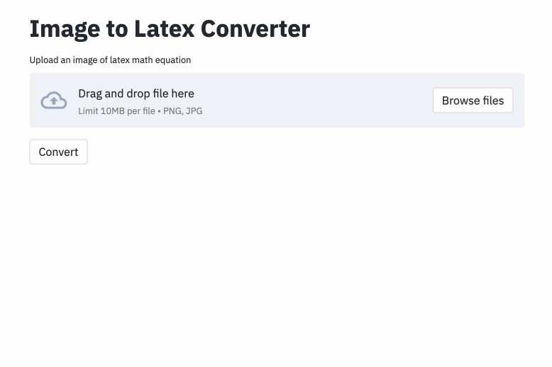

# Image to LaTeX

[](https://github.com/psf/black)
[](https://github.com/kingyiusuen/image-to-latex/blob/main/.pre-commit-config.yaml)

[](https://github.com/kingyiusuen/image-to-latex/blob/main/LICENSE)

An application that maps an image of a LaTeX math equation to LaTeX code.

<center></center>

## Introduction

The problem of image-to-markup generation has been attempted by [Deng et al. (2016)](https://arxiv.org/pdf/1609.04938v1.pdf). They provide the raw and preprocessed versions of [im2latex-100K](http://lstm.seas.harvard.edu/latex/data/), a dataset consisting of about 100K LaTeX math equation images. Using their dataset, I trained a model that uses ResNet-18 as encoder (up to layer3) and a Transformer as decoder with cross-entropy loss.

Initially, I used the preprocessed dataset to train my model, but the preprocessing turned out to be a huge limitation. Although the model can achieve a reasonable performance on the test set, it performs poorly if the image quality, padding, or font size is different from the images in the dataset. This phenomenon has also been observed by others who have attempted the same problem using the same dataset (e.g., [this project](https://wandb.ai/site/articles/image-to-latex), [this issue](https://github.com/harvardnlp/im2markup/issues/12) and [this issue](https://github.com/harvardnlp/im2markup/issues/21)). This is most likely due to the rigid preprocessing for the dataset (e.g. heavy downsampling).

To this end, I used the raw dataset and included image augmentation (e.g. random scaling, small rotation) in my data processing pipeline to increase the diversity of the samples. Moreover, unlike Deng et al. (2016), I did not group images by size. Rather, I sampled them uniformly and padded them to the size of the largest image in the batch, to increase the generalizability of the model.

Additional problems that I found in the dataset:
- Some latex code produces visually identical outputs (e.g. `\left(` and `\right)` look the same as `(` and `)`), so I normalized them.
- Some latex code is used to add space (e.g. `\vspace{2px}` and `\hspace{0.3mm}`). However, the length of the space is diffcult to judge. Also, I don't want the model generates code on blank images, so I removed them.

The [best run](https://wandb.ai/kingyiusuen/image-to-latex/runs/1w1abmg1/) has a character error rate (CER) of 0.17 in test set. It seems like The model seems to errorenously add unnecessary horizontal spacing, e.g., `\;`, `\,` and `\qquad`. (I only removed `\vspace` and `\hspace` during preprocessing. I did not know that LaTeX has so many horizontal spacing commands.)

Possible improvements include:

- Do a better job cleaning the data and normalizing the formulas
- Train the model for more epochs (For the sake of time, I only trained the model for 15 epochs, but the validation loss is still going down)
- Use beam search (I only implemented greedy search)
- Use a larger model (e.g., use ResNet-34 instead of ResNet-18)
- Do some hyperparameter tuning

I didn't do any of these, because I had limited computational resources (I was using Google Colab).

## How To Use

### Setup

Clone the repository to your computer and position your command line inside the repository folder:

```
git clone https://github.com/kingyiusuen/image-to-latex.git
cd image-to-latex
```

Then, create a virtual environment named `venv` and install required packages:

```
make venv
make install-dev
```

### Data Preprocessing

Run the following command to download the im2latex-100k dataset and do all the preprocessing. (The image cropping step may take over an hour.)

```
python scripts/prepare_data.py
```

### Model Training and Experiment Tracking

#### Model Training

An example command to start a training session:

```
python scripts/run_experiment.py trainer.gpus=1 data.batch_size=32
```

Configurations can be modified in `conf/config.yaml` or in command line. See [Hydra's documentation](https://hydra.cc/docs/intro) to learn more.

#### Experiment Tracking using Weights & Biases

The best model checkpoint will be uploaded to Weights & Biases (W&B) automatically (you will be asked to register or login to W&B before the training starts). Here is an example command to download a trained model checkpoint from W&B:

```
python scripts/download_checkpoint.py RUN_PATH
```

Replace RUN_PATH with the path of your run. The run path should be in the format of `<entity>/<project>/<run_id>`. To find the run path for a particular experiment run, go to the Overview tab in the dashboard.

For example, you can use the following command to download my best run

```
python scripts/download_checkpoint.py kingyiusuen/image-to-latex/1w1abmg1
```

The checkpoint will be downloaded to a folder named `artifacts` under the project directory.

### Testing and Continuous Integration

The following tools are used to lint the codebase:

`isort`: Sorts and formats import statements in Python scripts.

`black`: A code formatter that adheres to PEP8.

`flake8`: A code linter that reports stylistic problems in Python scripts.

`mypy`: Performs static type checking in Python scripts.

Use the following command to run all the checkers and formatters:

```
make lint
```

See `pyproject.toml` and `setup.cfg` at the root directory for their configurations.

Similar checks are done automatically by the pre-commit framework when a commit is made. Check out `.pre-commit-config.yaml` for the configurations.

### Deployment

An API is created to make predictions using the trained model. Use the following command to get the server up and running:

```
make api
```

You can explore the API via the generated documentation at http://0.0.0.0:8000/docs.

To run the Streamlit app, create a new terminal window and use the following command:

```
make streamlit
```

The app should be opened in your browser automatically. You can also open it by visiting [http://localhost:8501](http://localhost:8501). For the app to work, you need to download the artifacts of an experiment run (see [above](#Experiment-Tracking-using-Weights-&-Biases)) and have the API up and running.

To create a Docker image for the API:

```
make docker
```

## Acknowledgement

- This project is inspired by the project ideas section in the [final project guidelines](https://docs.google.com/document/d/1pXPJ79cQeyDk3WdlYipA6YbbcoUhIVURqan_INdjjG4/edit) of the course [Full Stack Deep Learning](https://fullstackdeeplearning.com/) at UC Berkely.

- [MLOps - Made with ML](https://madewithml.com/courses/mlops/) for introducing Makefile, pre-commit, Github Actions and Python packaging.

- [harvardnlp/im2markup](https://github.com/harvardnlp/im2markup) for pre-processing the im2latex-100k dataset.