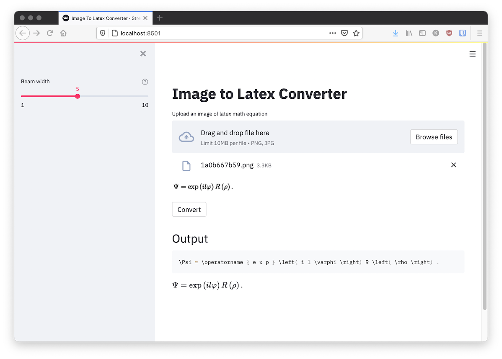

# Image to Latex

[](https://github.com/psf/black)
[](https://github.com/kingyiusuen/image-to-latex/blob/main/.pre-commit-config.yaml)
[](https://results.pre-commit.ci/latest/github/kingyiusuen/image-to-latex/main)

[](https://github.com/kingyiusuen/image-to-latex/blob/main/LICENSE)



An application that maps an image of an equation to the corresponding latex code.

The model I implemented uses an encoder-decoder architecture (Resnet-18 as encoder and a Transformer as decoder) with cross-entropy loss [(Singh & Karayev, 2021)](https://arxiv.org/abs/2103.06450).

The model was trained with the [im2latex-100K](http://lstm.seas.harvard.edu/latex/data/) dataset which has already been pre-processed by Deng et al. (2016) from Harvard. (The pre-processing turns out to be a huge limitation. See [below](#limitations).)

My model shows comparable results with the model developed by [Deng et al. (2016)](https://arxiv.org/pdf/1609.04938v1.pdf) on the test set, despite having a much fewer number of parameters and requiring a much shorter training time:

| Model              | # Params | Training time | BLEU     | Edit Distance |
|--------------------|----------|---------------|----------|---------------|
| Deng et al. (2016) | 9.48m    | 20 hours      | 87.73    | 87.60         |
| Mine               | 3.74m    | 30 mins       | 82.60    | 82.62         |

Deng's model was trained on a 12GB NVidia Titan X GPU, while I trained my model on a Tesla V100 SMX2. A comparison of the two GPUs can be found [here](https://www.gpuzoo.com/Compare/NVIDIA_Tesla_V100_SMX2__vs__NVIDIA_Titan_V/). They also used  beam search with a beam width of 5 during evaluation, while I only used greedy search. The chart for training/validation loss, the hyperparameters and the model checkpoint can be found in [Weights & Biases](https://wandb.ai/kingyiusuen/image-to-latex/runs/2pgs4rdi/).

## Setup

Clone the repository to your computer and position your command line inside the repository folder:

```
git clone https://github.com/kingyiusuen/image-to-latex.git
cd image-to-latex
```

Then, create a virtual environment named `venv` and install required packages:

```
make venv name="venv" env="dev"
```

## Model Training and Experiment Tracking

### Model Training

An example command to start a training session:

```
image-to-latex train \
    --max-epochs 30 \
    --lr 0.001 \
    --patience 10 \
    --save-best-model \
    --use-wandb \
    --resnet-layers 3 \
    --tf-dim 128 \
    --tf-fc-dim 256 \
    --tf-layers 4 \
    --tf-dropout 0.2
```

The im2latex-100k dataset will be downloaded automatically. Run the following command to learn the usage and see more available options.

```
image-to-latex train --help
```

There are model-dependent options that are not shown in the help message. To learn more about this, check out what arguments are being parsed from the input parameter `config` in `resnet_transformer.py` under `image_to_latex/models`. Note that the words in the arguments should be separated by dash instead of underscore when you put them in the command line.

### Experiment Tracking using Weights & Biases

To track the experiment using [Weights & Biases](https://wandb.ai), add ``--use-wandb`` to the train command. You will be prompted to create an account or log in to an existing account before the training starts. The training progress (e.g., training and validation losses) and results will be logged under a project named `image-to-latex` in the Weights & Biases dashboard.

After the training is finished, you can use the following command to download a json file that contains the configurations of the model and the trainer (to reproduce the results), a json file that maps tokens to integers, and a model checkpoint (if `--save-best-model` flag is used):

```
image-to-latex download-artifacts [RUN_PATH]
```

The run path should be in the format of `<entity>/<project>/<run_id>`. To find the run path for a particular experiment run, go to the Overview tab in the dashboard. For example, the run id for [this experiemnt]((https://wandb.ai/kingyiusuen/image-to-latex/runs/2pgs4rdi/)) is `kingyiusuen/image-to-latex/2pgs4rdi`.

### Training in Google Colab

If you want to train the model in Google Colab, you can follow the template in [notebooks/colab_training.ipynb](https://colab.research.google.com/github/kingyiusuen/image-to-latex/blob/main/notebooks/colab_training.ipynb). Note that there is limited memory in Colab, so you may want to adjust the hyperparameters and train a smaller model. See the model summary at the beginning of the training to find out the number of parameters in each layer. You can also consider upgrading to Colab Pro to get more memory.

## Testing and Continuous Integration

The following tools are used to lint the codebase:

`isort`: Sorts and formats import statements in Python scripts.

`black`: A code formatter that adheres to PEP8.

`flake8`: A code linter that reports stylistic problems in Python scripts.

`mypy`: Performs static type checking in Python scripts.

Use the following command to run all the checkers and formatters:

```
make lint
```

See `pyproject.toml` and `setup.cfg` at the root directory for their configurations.

Similar checks are done automatically by the pre-commit framework when a commit is made. Check out `.pre-commit-config.yaml` for the configurations.

When there is a pull request or a push to the main branch, a GitHub Actions workflow will be triggered to run unit tests on the codebase. See `.github/workflows/tests.yml` for details. You can also manually execute the tests by using

```
make test
```

or, if you want to avoid running tests that involves the trainer (as they may take a slightly longer time than other unit tests),

```
make test-non-training
```

## Deployment

A RESTful API is created to make predictions using a trained Resnet-Transformer model. Use the following command to get the server up and running:

```
make api
```

You can explore the API via the generated documentation at http://0.0.0.0:8000/docs.

To run the Streamlit app, create a new terminal window and use the following command:

```
make streamlit
```

The app should be opened in your browser automatically. You can also open it by visiting [http://localhost:8501](http://localhost:8501). For the app to work, you need to download the artifacts of an experiment run first (see [above](#Experiment-Tracking-using-Weights-&-Biases)).

To create a Docker image:

```
make docker
```

## Limitations

Although the trained model can achieve a reasonable performance on the test dataset, it performs poorly if the image quality, padding, or font size is different from the images in the dataset. This phenomenon has also been observed by others who have attempted the same problem using the same dataset (e.g., [this project](https://wandb.ai/site/articles/image-to-latex), [this issue](https://github.com/harvardnlp/im2markup/issues/12) and [this issue](https://github.com/harvardnlp/im2markup/issues/21)). To address this, future works should include image augmentation in their pre-processing pipeline to increase the diversity of the samples.

For the sake of time, I did not use beam search or perform any hyperparameter tuning. I only used the first three layers of Resnet, because I ran out of memory on Google Colab when I tried to use the full model.

## Acknowledgement

- This project is inspired by the project ideas section in the [final project guidelines](https://docs.google.com/document/d/1pXPJ79cQeyDk3WdlYipA6YbbcoUhIVURqan_INdjjG4/edit) of the course [Full Stack Deep Learning](https://fullstackdeeplearning.com/) at UC Berkely.

- [MLOps - Made with ML](https://madewithml.com/courses/mlops/) for introducing Makefile, pre-commit, Github Actions and Python packaging to me.

- [harvardnlp/im2markup](https://github.com/harvardnlp/im2markup) for pre-processing the im2latex-100k dataset.